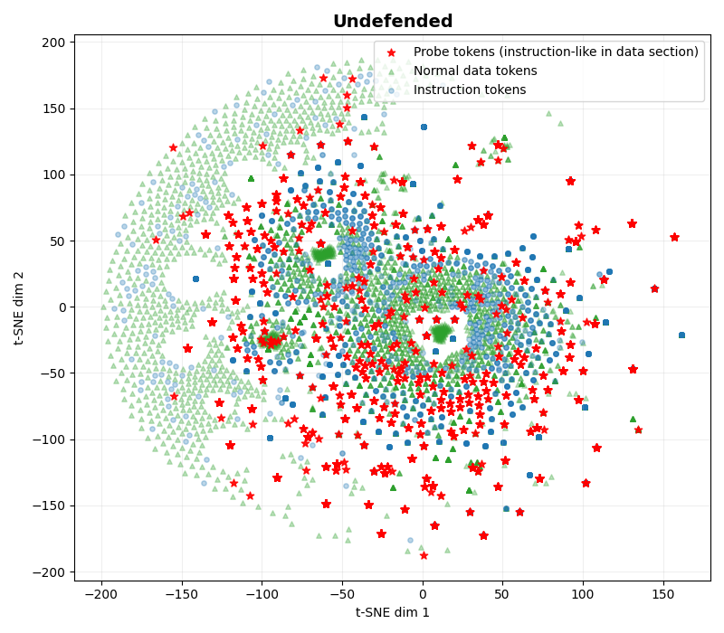
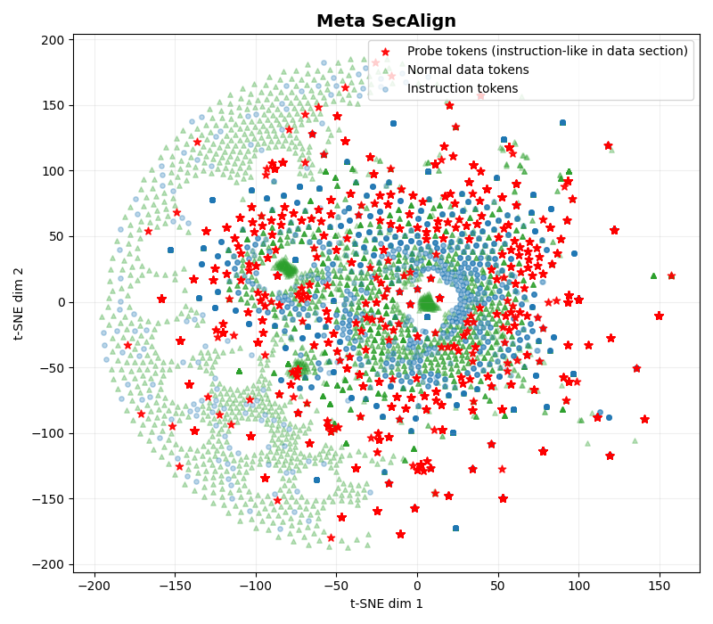
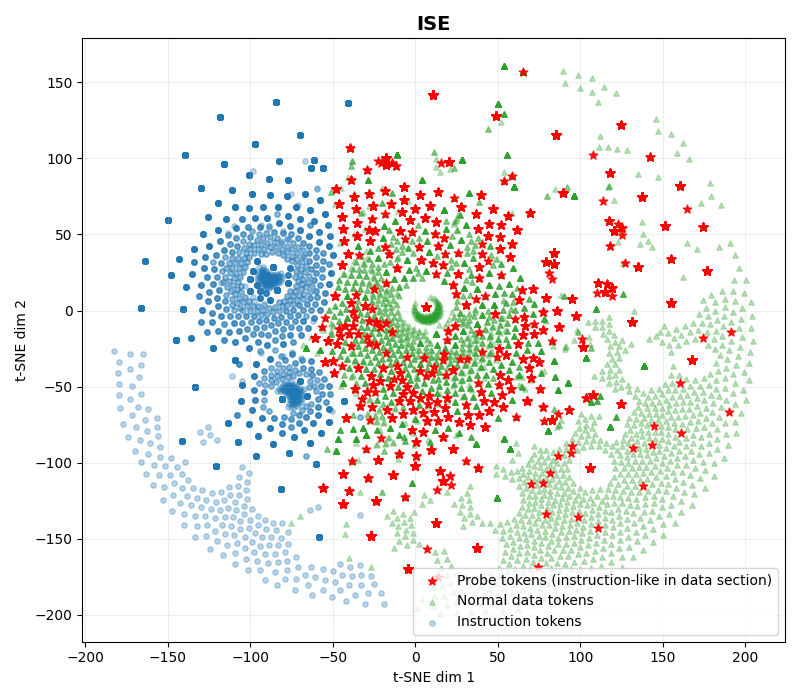
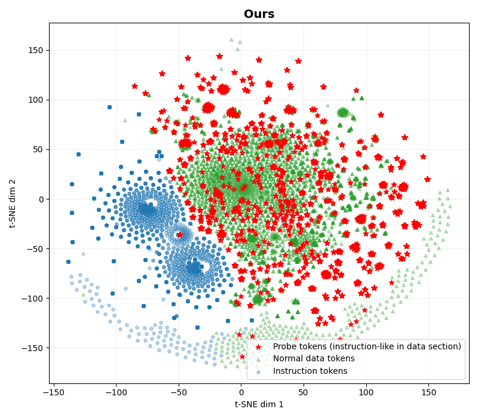

## Hidden State Representations Before the First Attention Block (t-SNE)

We randomly pick 200 samples from the SEP benchmark.
We visualize their token-level hidden states at the input to the first transformer block (i.e., immediately after the embedding
layer, before any attention is applied). Each point represents one token, colored
by its semantic role:

- 🔴 **Red stars** — *Probe tokens*: instruction-like adversarial text injected into the **data section**.
- 🔵 **Blue circles** — *Instruction tokens*: tokens in the legitimate system/instruction section.
- 🟢 **Green triangles** — *Normal data tokens*: benign content in the data section.

A well-defended model should push probe tokens (red) away from the instruction
cluster (blue) and into the data cluster (green), so that the first attention
block never confuses injected commands with genuine instructions.

---

### Undefended (Llama-3.1-8B-Instruct)

All three token types overlap heavily in a single undifferentiated cloud.
From the model's perspective, an adversarial instruction injected into the data section is
**geometrically indistinguishable** from a legitimate system instruction.

---

### Meta SecAlign

The distribution is nearly identical to the undefended baseline. 
SecAlign's DPO training changes the
model's *output behavior* but leaves the **input representation space unchanged**.

---

### ISE (Instruction-Segment Embedding)

ISE succeeds in pulling data and instruction apart. 
The instruction-segment embeddings shift *all* data tokens together.

---

### Ours (DRIP)

Our model produces the clearest separation. 
Instruction tokens (blue) form a compact, well-isolated cluster on the left. 
Normal data tokens (green) occupy a distinct right-side region. 
Crucially, probe tokens (red) **co-locate with the normal data cluster (green)** and are clearly pushed away from the instruction
cluster (blue). 
This means that by the time the first attention block runs,
the model already treats injected adversarial commands as ordinary data content
rather than as instructions.

