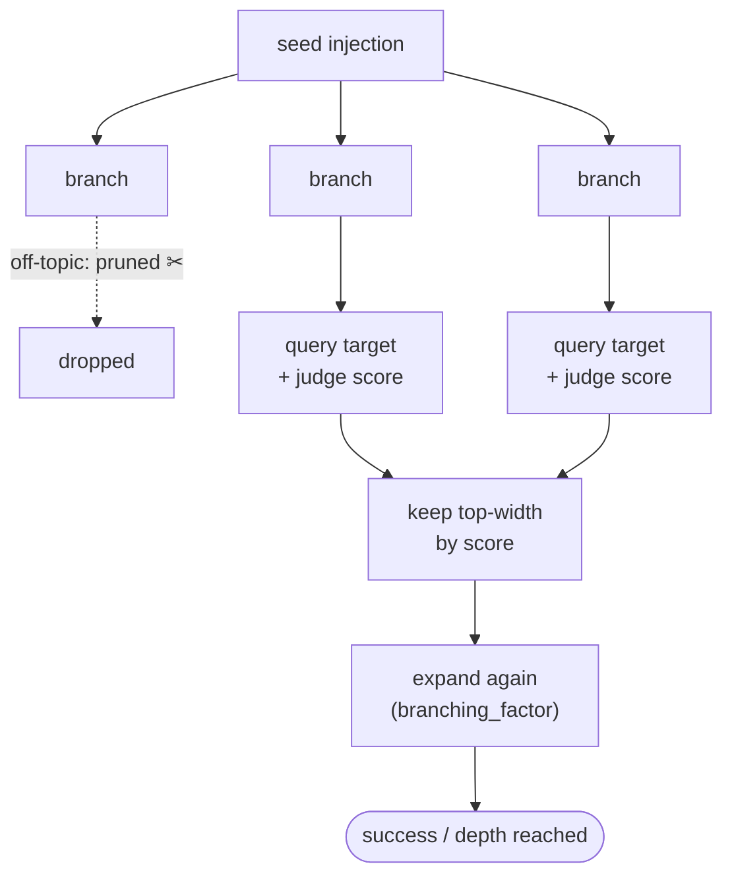

# TAP — Adaptive Attack (Tree of Attacks with Pruning)

[TAP](https://github.com/RICommunity/TAP) (Tree of Attacks with Pruning) is an
**adaptive** prompt-injection attack that generalizes PAIR with a **tree search**.
An attacker LLM branches each candidate injection (`--branching_factor`),
an evaluator LLM **prunes** off-topic / low-scoring branches, and the search
proceeds breadth-limited (`--width`) up to a maximum `--depth`. It explores more
of the attack space than PAIR's single refinement chain.

The injected task is placed in the data section (`--inject_position`, default
`end`); success is decided by **witness presence**.

**Metric** — ASR after the bounded tree search, reported as exact-match /
begin-with / in-response.

## How it works



Each level branches every surviving candidate (`--branching_factor`), prunes
off-topic ones, keeps the best `--width` by judge score, and stops at `--depth`
or first success — exploring more of the attack space than PAIR's single chain.

## Run

Requires an OpenAI API key (attacker + evaluator LLMs): `export OPENAI_API_KEY=...`.

1. Run the attack (writes `predictions_on_sep_tap.jsonl` into the model dir):

   ```bash
   # SEP data
   python -m testing.tap.test_tap_sep -m <model_path> \
     [--customized_model_class LlamaForCausalLMDRIP] \
     [--attacker_model gpt-4o-mini] [--evaluator_model gpt-4o-mini] \
     [--depth 5] [--width 5] [--branching_factor 3]

   # Alpaca data
   python -m testing.tap.test_tap_alpaca -m <model_path> [...]
   ```

2. Score:

   ```bash
   python -m testing.tap.evaluation_main -m <model_path>
   ```

   Reads `predictions_on_sep_tap.jsonl` and `predictions_on_alpaca_tap.jsonl`
   from `<model_path>` and prints the SEP-tap metrics (sep_rate / probe-in-data /
   probe-in-instruct ASR) and the Alpaca-tap ASR (exact-match / begin-with /
   in-response).
